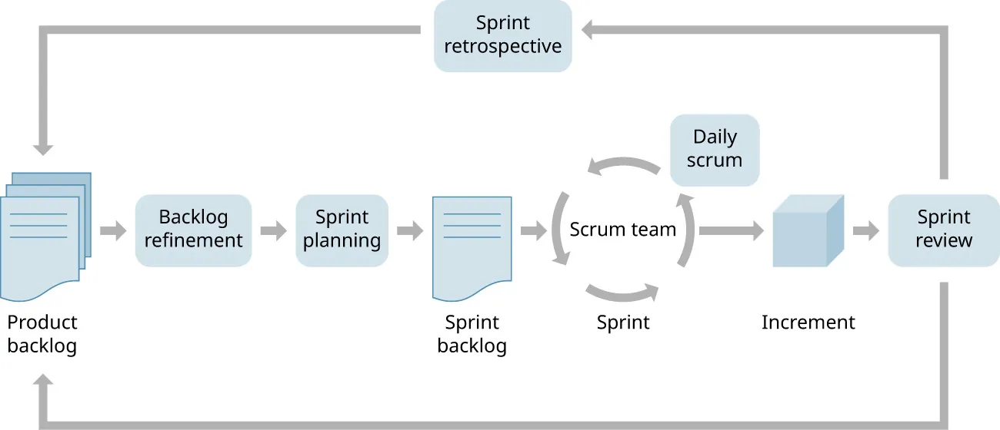

# Construction Process

**Construction is executed using Scrum:**

### 1. Create product backlog

- **Derive backlog items from Software Design Document**

### 2. Plan sprint

- **Assign dates to backlog items**
- **Set goals for the sprint**

### 3. Conduct sprint

- **TODO: WHEN WILL INSPECTIONS BE COMPLETED?**

### 4. Increment product

- **Establish an increment to be analyzed during the sprint review**

### 5. Conduct sprint review

- **Inspect product increment with stakeholders**
- **Identify which requirements were completed**
- **Identify which requirements still need to be completed**

### 6. Conduct sprint retrospective

- **Analyze the processes during the sprint**
- **Improve the scrum process**

### 7. Iterate

- **Modify product backlog as necessary**